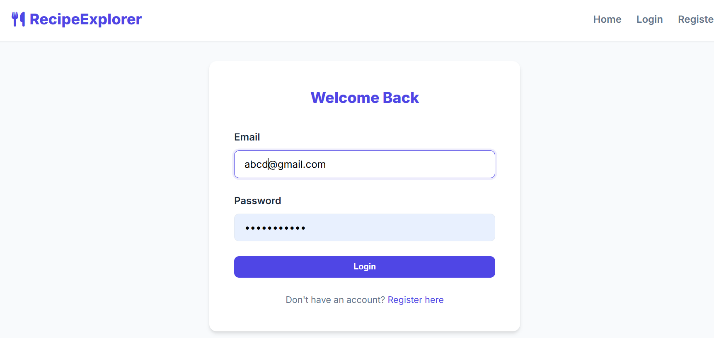
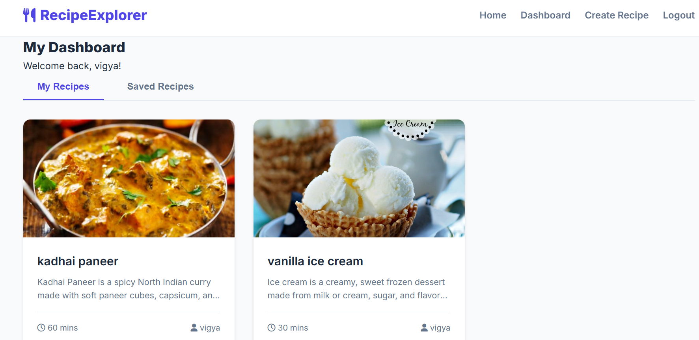
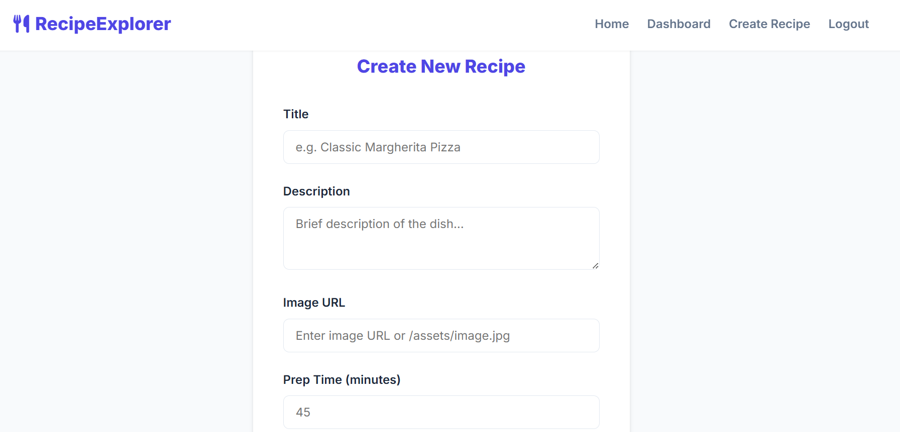

# Recipe Explorer

A full-stack web application that allows users to create, view, and manage recipes in one place.

---

## Features

* User registration and login (JWT based authentication)
* Create and store recipes
* View all recipes
* Add images to recipes
* Delete recipes
* Clean and simple UI

---

## Tech Stack

Frontend:

* HTML
* CSS
* JavaScript

Backend:

* Node.js
* Express.js

Database:

* MongoDB Atlas
* Mongoose

Authentication:

* JSON Web Tokens (JWT)
* bcryptjs

---

## Project Structure

recipe-explorer/

* middleware/
* models/
* routes/
* public/

  * assets/
  * css/
  * js/
  * index.html
* server.js
* package.json

---
## Screenshots

### Login Page

### Dashboard

### Create Recipe

## Setup Instructions

1. Clone the repository

git clone https://github.com/vigyamishra43-eng/recipe-explorer.git
cd recipe-explorer

2. Install dependencies

npm install

3. Create a `.env` file and add:

PORT=5000
MONGODB_URI=your_mongodb_connection_string
JWT_SECRET=your_secret_key

4. Run the server

node server.js

5. Open in browser

http://localhost:5000

---

## Notes

* `.env` is ignored using `.gitignore`
* Passwords are hashed using bcrypt
* MongoDB Atlas is used for cloud database

---

## Future Improvements

* Search functionality
* Filtering recipes
* Improved UI design
* Deployment

---

## Author

Vigya Mishra
